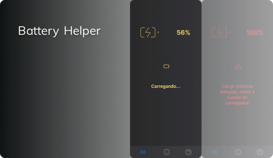

# Battery Helper

Battery helper é um app para monitorar o carregamento do celular.


## Descrição

Battery helper é um aplicativo mobile desenvolvido para monitorar e otimizar o carregamento do seu celular, tendo como objetivo central promover a sustentabilidade e a preservação do meio ambiente.


## Executando o projeto

Abaixo seguem as instruções para você executar o projeto na sua máquina.

Comece clonando o repositório e instalando suas dependências:

```sh
git clone https://github.com/matheusc1/battery-helper
cd battery-helper
npm install
```

Para executar o app mobile utilizamos o Expo, uma ferramenta incrível da comunidade React Native. Além do Expo, é necessário que você utilize algum emulador local ou um dispositivo físico pra visualizar a aplicação.

```sh
# Caso esteja usando Android
npm run android

# Caso esteja usando iOS
npm run ios

# Caso esteja usando um dispositivo físico
npm start
```

## Feito com

- [React Native](https://github.com/facebook/react-native)
- [Expo](https://github.com/expo/expo)
- [NativeWind](https://github.com/marklawlor/nativewind) _(Tailwind para o React Native)_

## Funcionalidades

- [ ] **Envio de notificações**

- [ ] **Monitoramento da bateria em tempo real**

## Contribuições 🆘

Este é um projeto simples feito para fins de aprendizagem. Se você gostaria de contribuir com o projeto, sinta-se à vontade para fazer um fork no repositório e enviar um pull request com suas melhorias.

## Layout 🎨

[Figma](https://www.figma.com/file/ymVMgjREUDaB64PcHBPB8l/Battery-Helper?type=design&node-id=57-2&mode=design&t=xdLNIx5XvqsMdDzA-0)

## Licença 📃

[MIT](https://github.com/matheusc1/battery-helper/blob/main/LICENSE)